# Manual do Usuário — CIFA

# Apresentação

A **CIFA** oferece integração bancária por API com os módulos financeiros do ERP Protheus.

> **Importante:** a localização dos menus da CIFA pode variar de empresa para empresa. Caso não encontre algum menu apresentado neste manual, consulte o suporte de TI/Protheus da sua empresa.

---

# Segurança

A apresentação destaca os seguintes recursos de segurança:

- Criptografia de ponta a ponta;
- Certificado digital;
- Dupla autenticação;
- Firewall de borda.

---

# Recebimento via Boleto

A CIFA permite disponibilizar boletos para clientes em diferentes plataformas e realizar a baixa do título no Protheus após o pagamento.

O boleto pode ser:

- **Híbrido**; ou
- **Normal**.

O tipo depende do banco e do contrato estabelecido entre a empresa e a instituição bancária.

## Geração do boleto

A geração do boleto pode ocorrer:

- Manualmente; ou
- Automaticamente no momento do faturamento.

Essa configuração é opcional e varia conforme cada empresa.

---

# Gestor de Boletos

O Gestor de Boletos disponibiliza diversas funções para gerenciamento dos títulos.

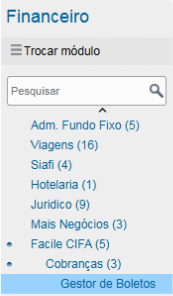
 Figura 1: Gestor de Boletos 

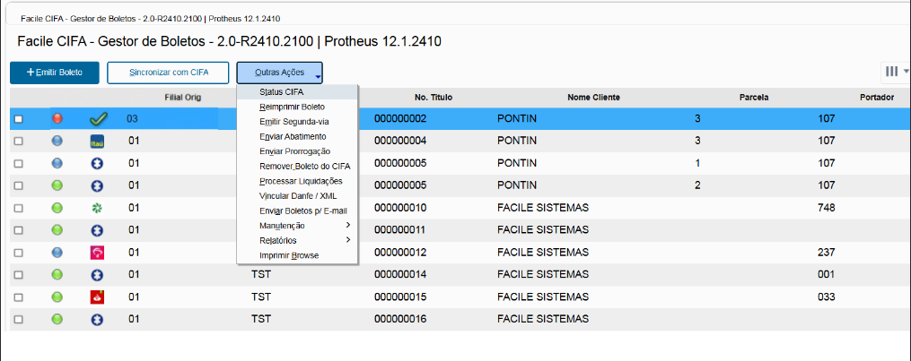
 Figura 2: Tela Outras Ações 

## Principais funções

- **Emitir Boleto**
- **Sincronizar com CIFA**
- **Status CIFA**
- **Reimprimir Boleto**
- **Emitir Segunda Via**
- **Enviar Abatimento**
- **Enviar Prorrogação**
- **Remover Boleto da CIFA**
- **Processar Liquidações**
- **Vincular DANFE / XML**
- **Enviar Boletos p/ e-mail**
- **Manutenção**
- **Relatórios**
- **Imprimir Browse**

## Emitir Boleto

A opção **+Emitir Boleto** permite gerar um ou mais boletos no banco através da CIFA.

Essa função deve ser utilizada quando a emissão automática não estiver ativa.

### Seleção dos títulos

Para emissão, selecione títulos que apresentem a legenda verde ou azul e estejam identificados com a logo azul do quebra-cabeça da Facile.

> **Atenção:** também é possível encontrar títulos com uma bolinha escura. Esses títulos são de Borderô e podem estar em CNAB. Tenha cuidado antes de realizar a operação.

## Sincronizar com CIFA

A função **Sincronizar com CIFA** realiza a sincronização entre o ERP Protheus e a instituição bancária através da CIFA.

É possível sincronizar um ou mais títulos.

Títulos que tiveram alteração de vencimento ou valor podem exigir sincronização manual.

A sincronização também pode ser configurada para execução automática via **job**, conforme a configuração da empresa.

## Outras ações

### Status CIFA

Consulta no banco o status do boleto.

### Reimprimir Boleto

Reimprime o **mesmo boleto** que foi gerado anteriormente.

### Emitir Segunda Via

Atualiza o boleto mais recente no banco, incluindo informações como juros.

### Enviar Abatimento

Sincroniza abatimentos com o banco.

### Enviar Prorrogação

Sincroniza prorrogações.

### Remover Boleto da CIFA

Realiza a remoção/baixa do boleto no banco conforme o processo da CIFA.

### Processar Liquidações

Processa liquidações (baixas) de uma data específica.

Após o processamento, consulte o relatório **Gestão de Títulos**.

### Vincular DANFE / XML

Utilizado quando a empresa utiliza o **CIFA Web (Boleto Facile)**.

### Enviar Boletos p/ e-mail

Envia o boleto para o endereço de e-mail cadastrado no cadastro do cliente.

### Manutenção

Utilizada para extrair **logs** e dados técnicos para o suporte CIFA.

### Relatórios

Disponibiliza o relatório **Gestão de Títulos**.

### Imprimir Browse

Imprime os registros que estão filtrados na tela do Browser.

---

# Cobranças PIX

O Gestor de Cobranças PIX permite gerar novas cobranças e processar retornos bancários.

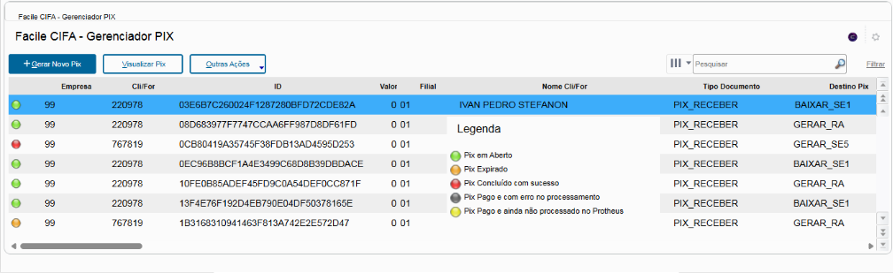
 Figura 3: Gestor Pix 

## Gerar Novo PIX

1. Acesse o Gestor de Cobranças PIX.
2. Clique em **+Gerar Novo Pix**.
3. Selecione o banco que será utilizado.
4. Siga o **wizard** apresentado pelo sistema.
5. Ao final do processo, será apresentado o QR Code PIX.

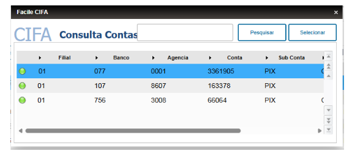
 Figura 4: Selecionar Banco 

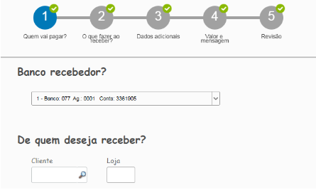
 Figura 5: Seguir Wizard 

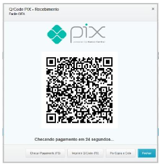
 Figura 6: Qr Code Pix 

O QR Code apresentado já estará válido para pagamento.

Também é possível:

- Copiar e colar a linha digitável;
- Imprimir o PDF do QR Code;
- Enviar o QR Code ao cliente pelo WhatsApp Web.

## Processar Retorno PIX

A função **Processar Retorno PIX** realiza a sincronização com o banco para verificar se os PIX foram pagos.

Esse processo também pode ser executado automaticamente via **job**, conforme a configuração da empresa.

 Figura 7: Processar Retorno Pix 

---

# Módulo de Pagamentos

O módulo de pagamentos possui recursos de integração com fornecedores, DDA e pagamentos.

Entre as funcionalidades apresentadas estão:

- Conciliação automática com títulos de fornecedores;
- Busca de DDA diretamente na instituição bancária;
- Tela no ERP para conciliação manual.

## Regra de conciliação automática

A regra apresentada para conciliação automática é:

**Raiz do CNPJ + Valor + Vencimento**

A busca de DDA pode ocorrer automaticamente quando o **job** estiver configurado ou ser executada manualmente.

---

# Gestor de DDA

O Gestor de DDA permite consultar e conciliar registros de DDA com os títulos do Contas a Pagar.

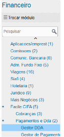
 Figura 8: Gestor DDA 

Busca de DDA diretamente na instituição bancária: Quando Configurado o Job
Automático.
Neste caso, os que estão em vermelho, já foram conciliados automaticamente.
A qualquer momento pode ser executado manualmente pelo botão Conciliar
Automático

## Conciliação automática

Quando o DDA é conciliado automaticamente, o sistema apresenta a indicação correspondente.

A qualquer momento, pode ser executada a opção:

**Conciliar Automático**

 Figura 9: Gestor DDA conciliado 

## Conciliação manual

Para registros que não foram conciliados automaticamente, mas cuja correspondência esteja correta:

1. Marque manualmente os registros.
2. Clique em **Conciliar Selecionados**.
3. Confirme a operação.

Após a conciliação, os boletos serão vinculados aos títulos do Protheus.

## Buscar DDA

Também é possível realizar uma busca específica de DDA para determinado fornecedor.

Caso não apareça nenhum DDA, existem duas possibilidades apresentadas no material:

1. Não existe DDA para a data selecionada; ou
2. É necessário realizar uma nova busca na CIFA.

Nesse segundo caso, utilize:

**Buscar DDA na CIFA**

## Conciliar DDA com título

Quando existir um DDA no período selecionado:

1. Localize o DDA na tela.
2. Marque o registro correspondente.
3. Localize o título aberto no Contas a Pagar referente ao fornecedor.
4. Marque o título.
5. Clique em **Conciliar Selecionados**.

---

# Gestor de Pagamentos

O Gestor de Pagamentos permite selecionar títulos e preparar ordens de pagamento.

## Selecionar títulos

Ao acessar o gestor, será apresentado um filtro para definir quais títulos serão pagos.

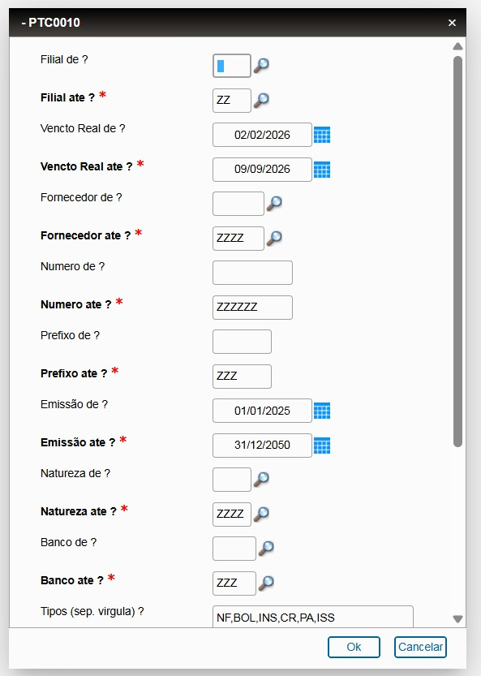
 Figura 10: Filtro de Titulo 

Depois de aplicar o filtro, os títulos correspondentes serão apresentados.

## Selecionar a conta bancária

Após definir os títulos, deverá ser escolhida a **conta banco** que será utilizada para o pagamento.

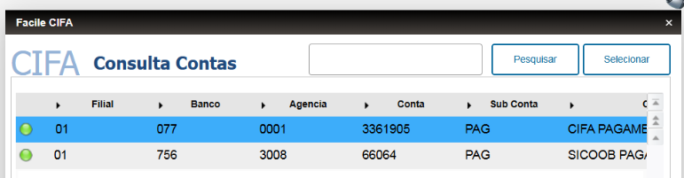
 Figura 11: Selecionar Conta 

## Legendas

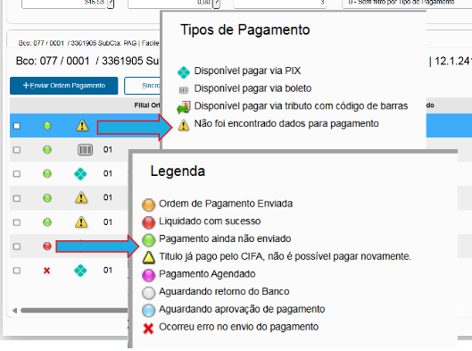
 Tela de Legendas 

## Operações disponíveis

O operador poderá:

- Alterar dados de pagamentos;
- Alterar datas de pagamento;
- Confirmar Ordem de Pagamento;
- Checar a amarração de DDA.

## Alterar dados do pagamento

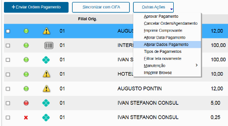
 Figura 12: Alterar Dados de Pagamento 

Caso o título tenha DDA, a **linha digitável** e o **código de barras** serão preenchidos automaticamente.

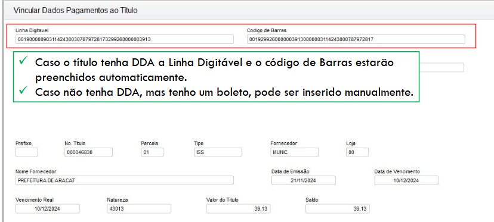
 Figura 13: Titulo DDA 

Caso não exista DDA, mas exista um boleto, os dados poderão ser inseridos manualmente.

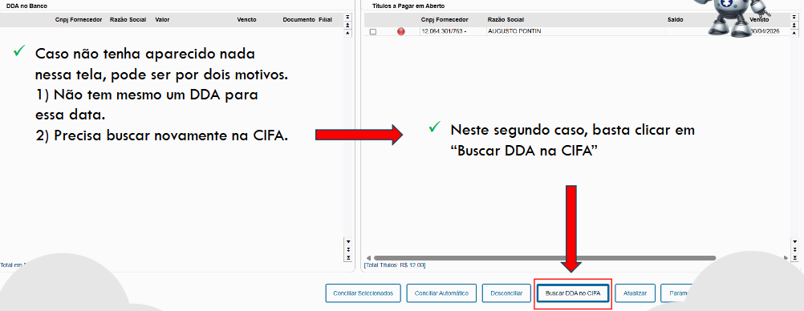
 Figura 14: Busca DDA Cifa 

Também é possível procurar DDA específico para o fornecedor através da opção:

**Buscar nos DDA's**

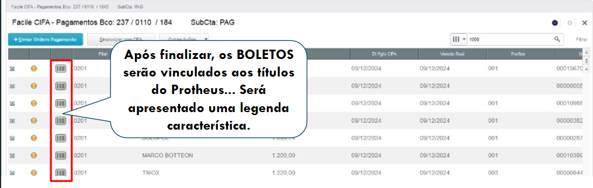
 Figura 15: Boleto Finalizado 
---

# Transferências PIX

A CIFA permite realizar pagamentos via PIX diretamente pelo ERP.

Entre os recursos apresentados estão:

- Consulta e liquidação dos títulos no ERP;
- Pagamento via PIX;
- Autorização do pagamento diretamente pelo ERP.

## Chaves PIX aceitas

O sistema aceita:

- Telefone;
- CPF/CNPJ;
- E-mail;
- Agência/Conta;
- Chave aleatória;
- Copia e Cola.

## Informar o tipo de chave

Quando o pagamento for realizado por chave PIX:

1. Acesse os dados de pagamento.
2. Informe o campo **Tipo de Chave PIX**.
3. Selecione o tipo correspondente:
   - Telefone;
   - E-mail;
   - CPF/CNPJ;
   - Aleatória;
   - Agência/Conta;
   - Copia e Cola.

Depois, defina a forma de pagamento padrão do fornecedor.

Os títulos com pagamento via PIX serão identificados por um ícone específico.

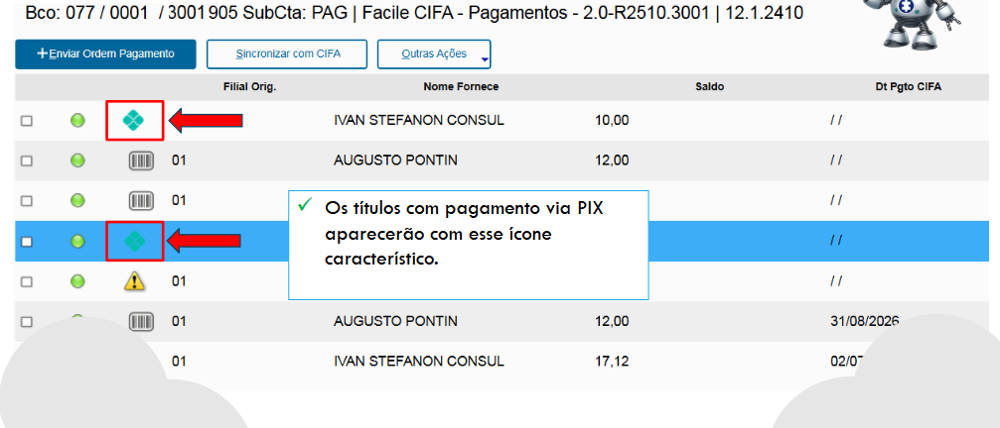
 Figura 16: Titulo Pix 

Títulos sem forma de pagamento previamente definida também apresentarão uma identificação própria e, ao serem acessados, solicitarão os dados necessários.

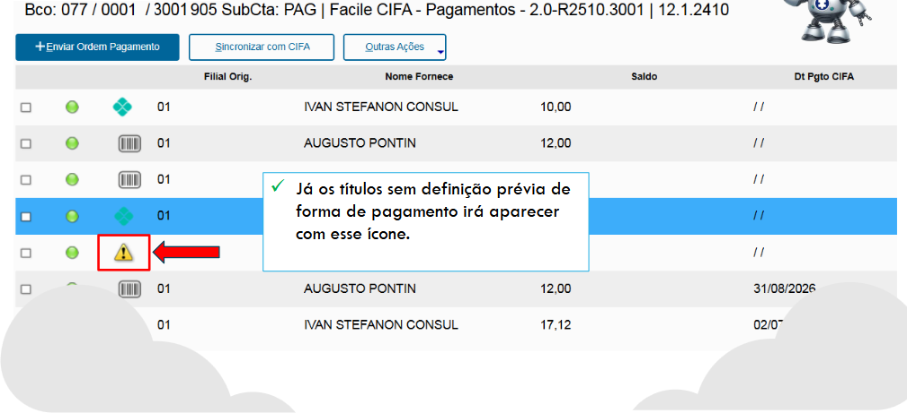
 Figura 17: Sem Forma de Pagamento 

---

# Impostos

O módulo permite trabalhar com pagamentos de impostos e guias que possuem código de barras.

São apresentados no material:

- **GPS — Guia da Previdência Social**
- Guias de recolhimento com código de barras;
- **GRU** com código de barras;
- **DARF Preto** com código de barras.

Também é possível realizar a autorização do pagamento diretamente pelo ERP.

Os impostos com código de barras serão identificados por um ícone característico.

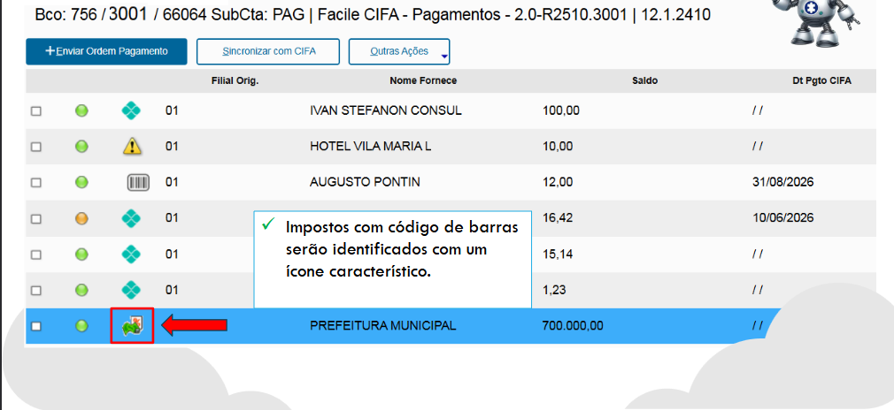
 Figura 18: Impostos Codigo de Barra 

---

# Aprovação de Pagamentos

O processo de aprovação envolve a seleção dos títulos, envio da ordem de pagamento, aprovação pelo usuário responsável e sincronização com a CIFA.

## 1. Selecione os títulos

Selecione os títulos que serão pagos.

## 2. Verifique a data de pagamento

Caso o pagamento seja para o dia atual, é necessário **alterar a data de pagamento** conforme o procedimento do sistema.

## 3. Envie a Ordem de Pagamento

Após conferir os dados, utilize:

**Enviar Ordem de Pagamento**

## 4. Aguarde a aprovação

Se o título ficar com a **legenda azul**, será necessário que o aprovador finalize o processo.

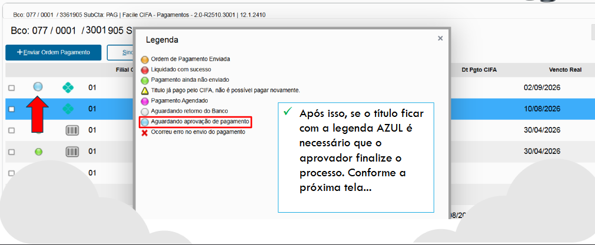
 Figura 19: Legenda Azul 

O usuário previamente cadastrado deverá realizar a aprovação para liberar o pagamento junto ao banco.

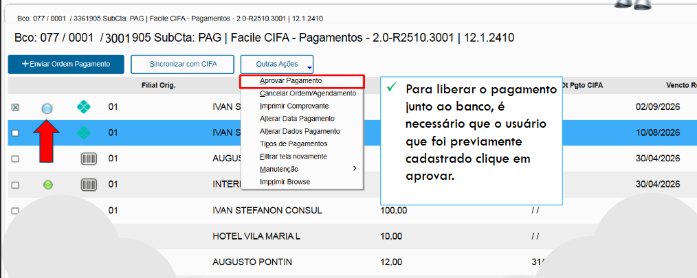
 Figura 20: Aprovar Pagamento 

## 5. Após a aprovação

Depois da transmissão da aprovação, os títulos aprovados ficarão com a **legenda laranja**, indicando:

> Ordem de Pagamento enviada. Aguardando Liquidação.

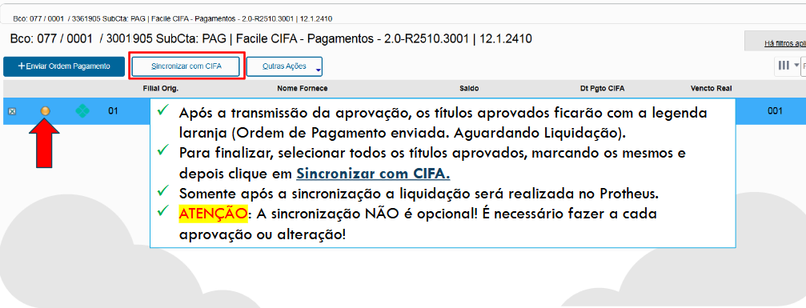
 Figura 21: Aprovamento concluído 

## 6. Sincronize com a CIFA

Para finalizar:

1. Selecione todos os títulos aprovados.
2. Clique em **Sincronizar com CIFA**.
3. Aguarde o término da sincronização.

Os títulos que tiverem o símbolo de seta verde, tiveram alteração de vencimento ou
valor, devem ser sincronizados manualmente.
Também existe a possibilidade dessa sincronia
ser feita de forma automática via job.

> **ATENÇÃO:** a sincronização **não é opcional**. Ela deve ser realizada a cada aprovação ou alteração.

Somente após a sincronização a liquidação será realizada no Protheus.

## 7. Consultar títulos liquidados

Após a sincronização, os títulos finalizados ficarão com a **legenda vermelha**.

Para consultar:

1. Acesse **Filtrar Status CIFA**.
2. Selecione a opção **4 — Liquidado**.
3. Marque o título desejado.
4. Clique em **Imprimir Comprovante**.

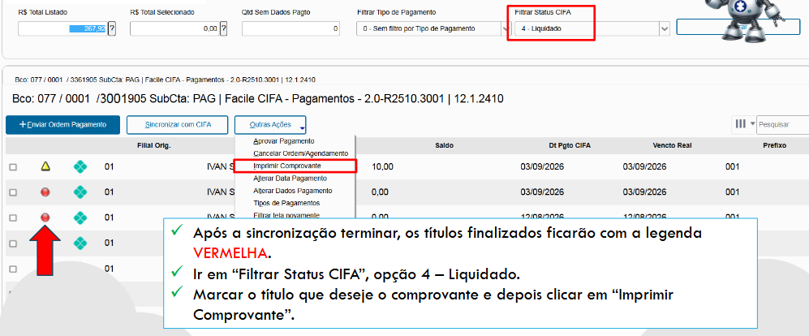
 Figura 22: Pós-Sincronização 

## 8. Título reaberto após pagamento

Caso um título tenha sido reaberto ou sua baixa tenha sido cancelada após o pagamento, a legenda de status será alterada.

Mesmo nesse caso, o comprovante poderá continuar sendo impresso.

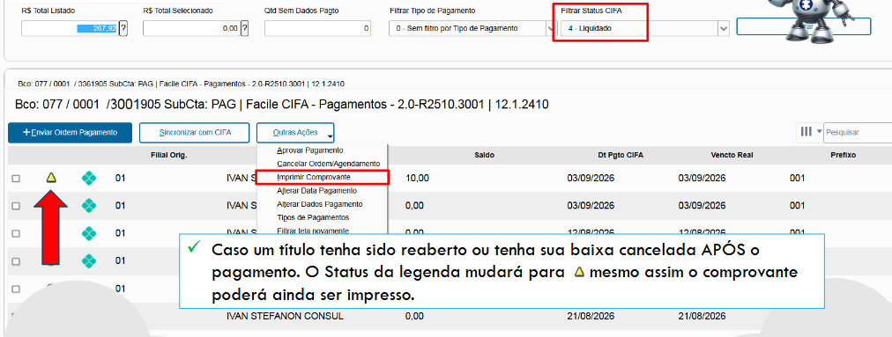
 Figura 23: Titulo Reaberto 

## 9. Consultar LOG

Caso seja necessário acompanhar o LOG de um título ou enviar informações para o suporte:

**Outras Ações → Manutenção**

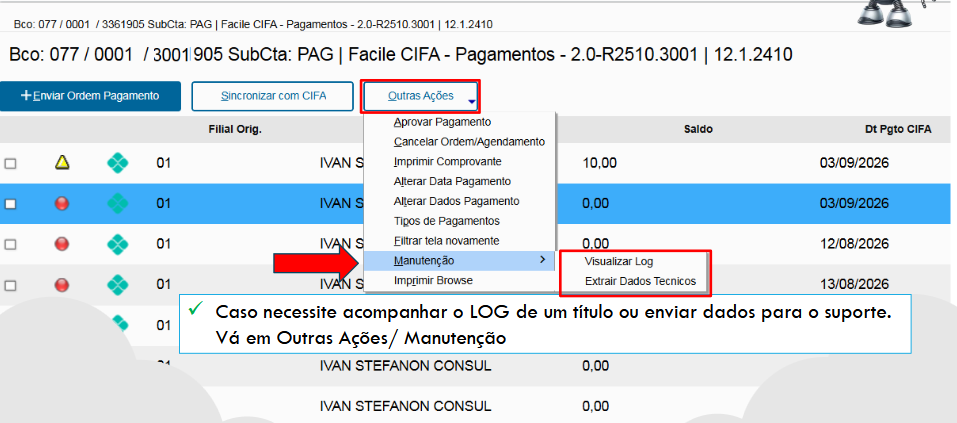
 Figura 24: Manutenção 

---

# Gestor de Saldos e Extratos

O Gestor de Saldos e Extratos realiza a integração de informações bancárias através de API.

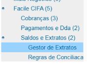
 Figura 25: Gestor de Extratos 

## Importação do extrato

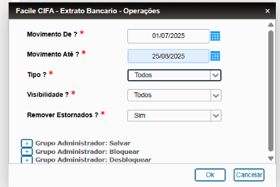
 Figura 26: Filtro Extrato 

No menu inicial, selecione o período que será importado do banco.

> **Importante:** não é possível importar o extrato do dia corrente. A importação deve considerar sempre pelo menos um dia anterior.

Após a importação, o sistema apresenta:

- Extrato importado do banco via API;
- Movimento bancário no ERP Protheus correspondente ao mesmo período.

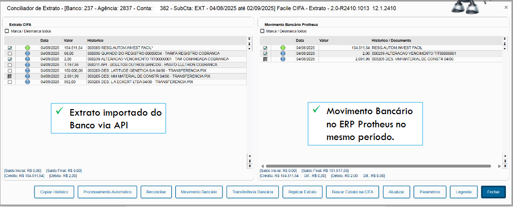
 Figura 27: Tela Info Extrato 

## Situações dos movimentos

O Gestor de Extratos apresenta movimentos em diferentes situações:

### Movimentos conciliados automaticamente

São movimentos identificados e conciliados automaticamente pelo sistema.

### Movimentos reconciliados manualmente

São movimentos que passaram pelo processo de reconciliação manual.

### Movimentos existentes somente no banco

São movimentos registrados no banco para os quais não existe um movimento correspondente no Protheus.

Nesse caso, é possível:

- Criar um movimento bancário único; ou
- Utilizar **Replica Extrato** para replicar um ou mais movimentos.

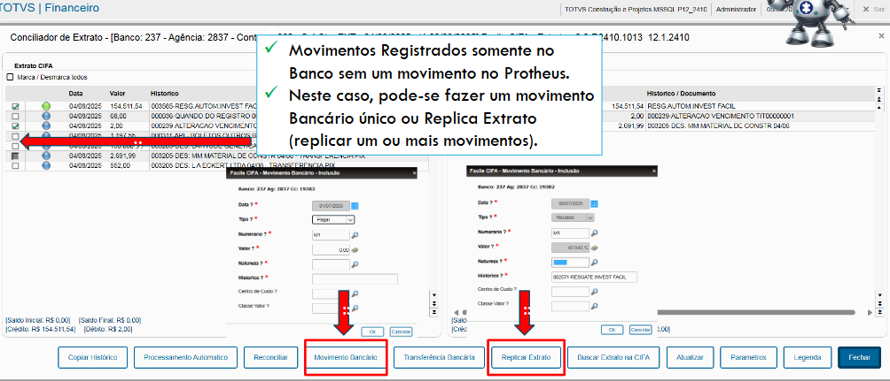
 Figura 28: Movimento Bancário 

---

# Regras de Conciliação

A CIFA permite criar regras para movimentos pré-definidos.

Essas regras podem fazer com que determinados movimentos sejam replicados automaticamente para o Protheus quando ocorrerem no banco.

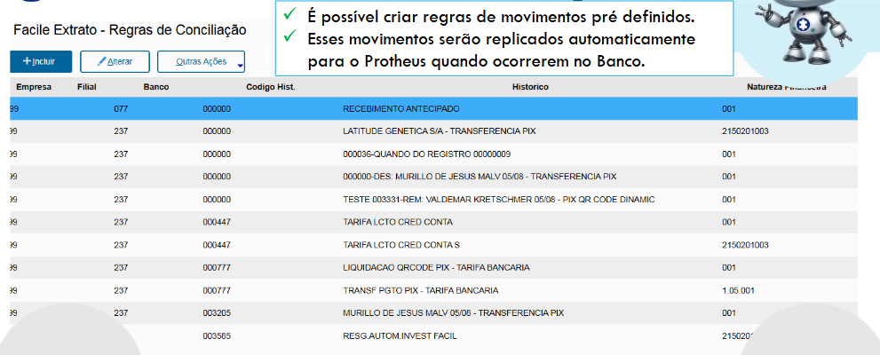
 Figura 29: Regras de Movimentos 

Um exemplo apresentado é a criação de um movimento automático para **tarifa**.

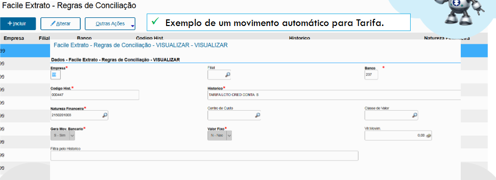
 Figura 30: Criação Movimento automático 

---

# Suporte

Caso tenha dificuldades para localizar um menu, executar uma operação ou interpretar uma situação apresentada pelo sistema, consulte o responsável pelo suporte de TI/Protheus da sua empresa.

Para informações técnicas relacionadas à CIFA, utilize a função **Manutenção** quando necessário para extrair LOGs e dados técnicos destinados ao suporte.

---

> **Confidencialidade:** o material de referência informa que as informações sobre produtos e serviços são de propriedade imaterial da Facile Sistemas e que sua utilização é destinada ao uso interno do cliente, observadas as condições de autorização previstas no próprio documento.
