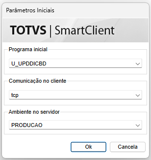
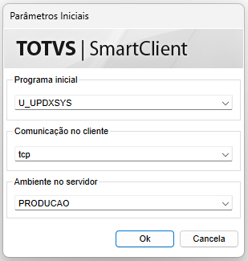

# 🤖Compatibilizador

A ferramenta utiliza tabelas, campos, índices e parâmetros customizados, com isso precisamos executar o compatibilizador para que sejam criados corretamente. 

Para aplicação do compatibilizador, basta chamar no programa inicial do ERP conforme conforme tipo de dicionário utilizado.

**ATENÇÃO:** Deverá ser utilizado APENAS UMA DAS DUAS OPÇÕES de acordo com a implantação do seu Protheus.

## Dicionário no Banco de Dados

Deverá ser utilizado o compatibilizador: **U_UPDDICBD**

## Dicionário na SYSTEM

Deverá ser utilizado o compatibilizador: **U_UPDXSYS**

## O que foi criado?

Para saber tudo que foi criado pelo nosso compatibilizador, basta acessar a documentação:

[Dicionário de Dados](../dicionario-dados.md)
