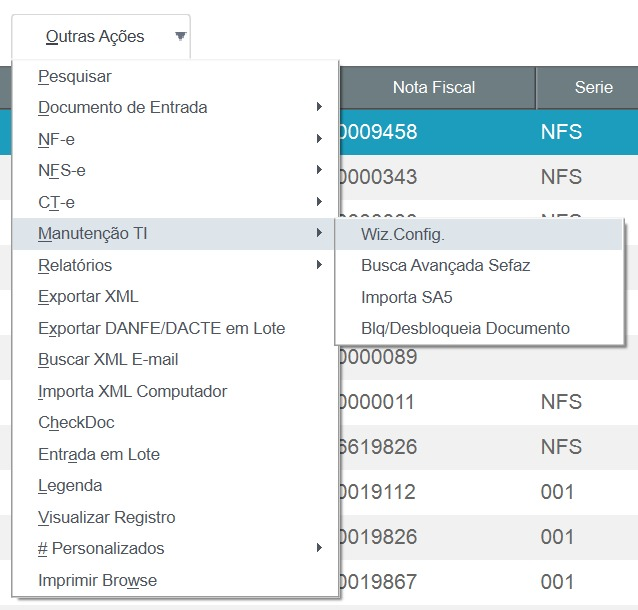

# Atualização do Certificado Digital

## Passo a Passo

### Observações iniciais

Importação do certificado digital para comunicação com o SEFAZ.

**Importante:** O arquivo do certificado digital precisa estar no mesmo computador que estiver realizando o procedimento, seja na estação do usuário ou no servidor.

***OBSERVAÇÃO:***	Caso o seu usuário tenha acesso a várias filiais na mesma tela (múltiplas filiais no browse), é necessário estar com a FILIAL a ser atualizada filtrada no browse para que o certificado seja vinculado corretamente a filial!

### Passo 01

Com usuário admin, abra a tela do FACILE XML-e.

 *Figura 1: Tela do FACILE XML-e* {: .center-img }
 

### Passo 02

Vá na opção em Outras Ações > Manutenção TI > Wiz. Config.

 *Figura 2: Opção Wiz. Config.* {: .center-img }
 

### Passo 03

Avance até a tela abaixo.

 *Figura 3: Assistente de configuração* {: .center-img }
 

Informe o caminho do arquivo do certificado digital (.PFX) e a sua senha de autenticação, processo parecido com o realizado na configuração do TSS.

Caso não possua o .PFX ou tenha alguma dificuldade na importação do certificado digital, poderá ser utilizado os arquivo “.PEM” gerados pelo TSS, bastando informar o caminho dos arquivos nos seguintes parâmetros:

**ZZ_CERTKEY:** caminho para o arquivo “key.pem” no Protheus_Data.
    Exemplo: \FACILE\9901_key.pem 

**ZZ_CERTPRI:** caminho para o arquivo “cert.pem” no Protheus_Data.
    Exemplo:\FACILE\9901_cert.pem                                                                                     
                                                                                   
**ZZ_CERTKEY:** caminho para o arquivo “ca.pem” no Protheus_Data.
	Exemplo: \FACILE\9901_ca.pem 

-FIM-
