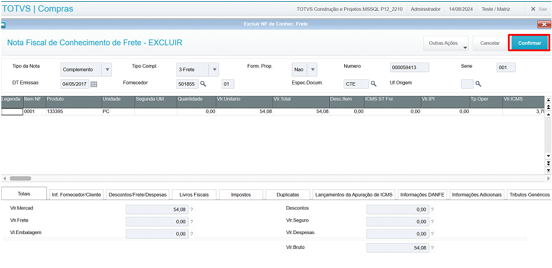

# Cancelar Conhecimento de Frete

## Introdução

O objetivo do cancelamento do conhecimento de frete é cancelar o CTe de Compra. Isso é possível através da Central XML-e.

## Como usar?

Na Central XML-e, ir em Outras Ações >> Documento de entrada >> Nt Conhecimento Frete Padrão, conforme imagem abaixo. 

 *Figura 1: Acesso à rotina pela Central XML-e* 

 

Na opção "Quanto a Nota", escolha a opção "Excluir NF de Conhec. Frete", conforme imagem abaixo.

 *Figura 2: Escolher opção de exclusão de CTe* 

 

Após isso, preencha os filtros "Data Inicial", "Data Final" e "Fornecedor".

 *Figura 3: Preenchimento de filtros* 

 

Clique em "Confirma" para que o sistema efetue a busca dos CTes com base no filtro escolhido.

 *Figura 4: Botão de confirmar* 

 

A tela seguinte apresentará os CTes encontrados. Basta escolher um CTe e clicar no botão "Excluir", para que a tela de Exclusão de Documento de Entrada apareça.

 *Figura 5: Tela pós-filtro* 

 

Os dados já virão preenchidos automaticamente. Confirme se estão corretos e clique em "Confirmar".

 *Figura 6: Tela de dados e confirmação da exclusão* 

 

-FIM-
