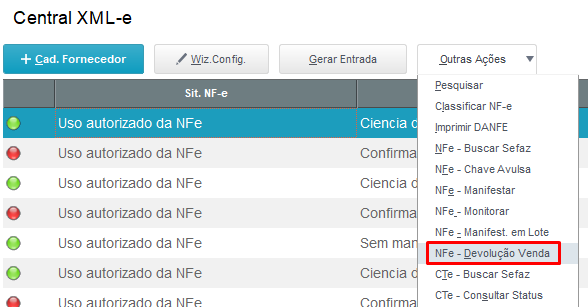
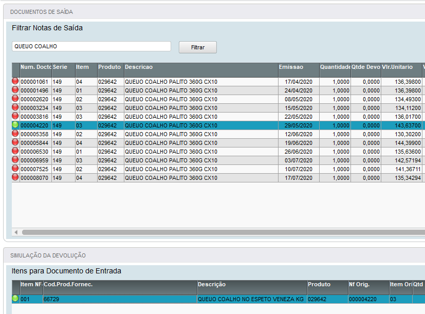
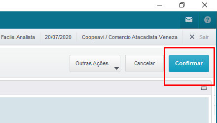

# Devolução de Venda

## Introdução

O objeto desse manual é demonstrar a utilização da funcionalidade de devolução de vendas pela Central XML-e.

Será verificado:

- Vendas realizadas para o cliente.
- Demonstra as quantidades já devolvidas por nota fiscal de venda.
- Permite fácil amarração entre a nota de venda e o item devolvido.

## Como usar?

Para que seja realizado a devolução da venda, basta selecionar o documento desejado na tela principal da Central XML-e e chamar a ferramenta conforme demonstrado na imagem abaixo:

 *Figura 01: Opção 'Devolução Venda'* {: .center-img }
 

Será apresentado uma nova tela conforme a imagem abaixo:

 *Figura 02: Filtrar notas de saída* {: .center-img }
 

No formulário **“Documentos de Saída”** irá demonstrar todas as notas fiscais de vendas para o cliente em questão que ainda possuem saldo a serem devolvidos. Esse formulário possui um filtro inteligente para que a busca pelo documento/item devolvido seja mais rápida e fácil.

No formulário **“Simulação da Devolução”** demonstra os itens devolvidos pelo cliente.

Para vincular o item da venda com o item devolvido, basta dar 2 cliques no item desejado no formulário de cima (note que a legenda do item selecionado vai ficar verde) e dar 2 cliques no item do XML devolvido pelo cliente (o item também ficará verde).

Após realizar a amarração de todos os itens com seus respectivos documento de saída, basta clicar no botão confirmar para iniciar o processo de geração do documento de saída.

 *Figura 03: Opção 'Confirmar'* {: .center-img }
 

A partir desse momento a rotina seguirá o fluxo normal do processo de entrada de documentos da Central XML-e.
Basta conferir os dados gerados e concluir a entrada do documento fiscal.

-FIM-
