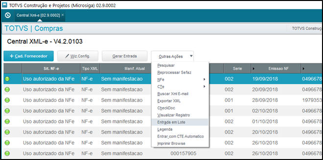
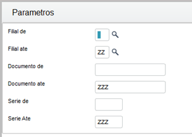
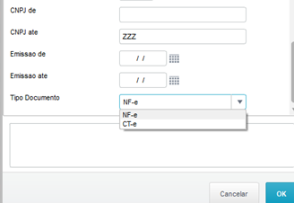
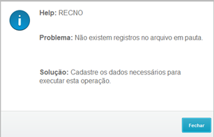
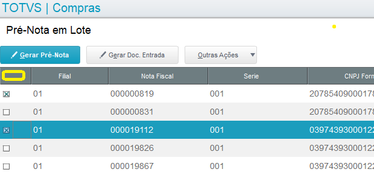
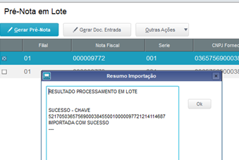
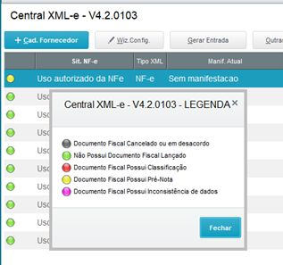
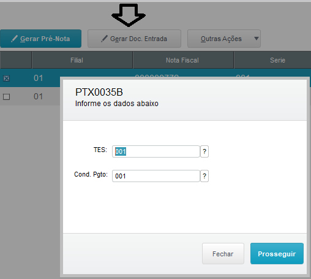
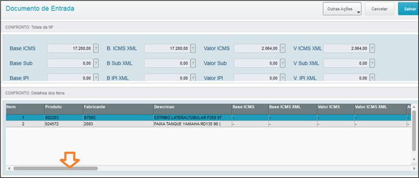
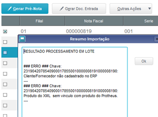

# Entrada em Lote

## Objetivo

Facilitar a entrada massiva de: Pré-notas e Documento de Entrada, sempre que, exista previamente o cadastro de fornecedores, e a ralação de produtos x fornecedor na Central XML.

*Observação: A rotina usa os XML´s baixados.*

Para utilizar a funcionalidade, acesse a central xml-e devidamente configurada em seu menu no Protheus e selecione: **Central Xml > Outras Ações > Entrada em Lote.**

- Como na imagem abaixo:

 *Figura 1: Opção entrada em lote* 

 

## Definir os filtros para receber os XMLs

 *Figura 2: Tela de Parâmetros* 

 

- **Filial de; até:** Selecionar a filial;
- **Documento de; até:** Números de documentos de entrada;
- **Serie de; até:** Séries dos documentos de entrada;
  

 *Figura 3: Tela de Parâmetros* 

 

- **CNPJ de; até:** CNPJ´s dos fornecedores – numérico sem formatação-;
- **Emissão de; até:** Datas das entradas das notas;
- **Tipo de Documento:** Nf-e ou CT-e;
  

Caso os filtros não encontrem concordância com os dados no sistema (datas, documentos, cnpj e etc.), será apresentada a tela abaixo.

 *Figura 4: Erro nos filtros dos Parâmetros* 

 

***Nessa situação, refaça os filtros e tente de novo.***

Após fazer o passo anterior você verá uma nova tela com os XML´s.

 *Figura 5: Pré-Nota em Lote* 

 

Para selecionar todos os xmls, é necessário apertas duas vezes na coluna em amarelo, agora, se quer selecionar os xmls individualmente, é necessário apertar duas vezes cada quadradinho referente a cada xml.

## Gerar Pré-Nota

Após selecionar os xmls que deseja, clicar em "Gerar Pré-nota".

 *Figura 6: Resultado do Processamento em Lote* 

 

Foi gerada a pre-nota..!

Em seguida, fechar a tela de entrada em lote e sair da rotina Central-xml para atualizar o status.

 *Figura 7: Tela Principal da Central XML-e com as Legendas* 

 

Essa nota fica com amarelo: “documento com pré-nota”

Acessse a rotina padrão “Pre Nota Entrada”, e verifique que já esta essa nota.

*OBS.: pode excluir a prenota e repetir o processo em lote.*

## Gerar Documento de Entrada

Ao apertar o botão "Gerar Doc. Entrada", aparecerá a tela abaixo.

 *Figura 8: Informar TES e Condição de Pagamento* 

 

Informar TES e condição de Pagamento.

***OBS.: Esta rotina dara entrada em notas, sem considerar obrigatoriedade de pedidos de compra.***
***Só recomendada para entradas de notas com a mesma TES e condição de pagamento.***

Mostra a tela confrontando os dados de impostos do XML, e o que esta calculando nas configuraçoes de impostos do Protheus.

 *Figura 9: Confronto de dados de impostos do XML* 

 

Se tiver inconsistencias, vai avisar se deseja mesmo assim, dar entrada na nota. Só podera dar entrada se tiver a senha que autoriza.

*Obs: no cabeçaho de totais, mostra os impostos procipais, e no detalhe, mostra as divergencias ou não,  por item (use a barra de rolagem)*

Após “SALVAR”, pode verificar na rotina padrao protheus: “Documanto de Entrada”, a nota de entrada.

## Erros nos processos, Gerar Pré-Nota e Gerar Documento de Entrada

 *Figura 10: Possíveis erros na Entrada em Lote* 

 

Caso o xml esteja sem vinculo com dados do Portheus, por exemplo: Fornecedor ou codigo de produto ralacionado. 

Sera apresentado o aviso de erro.

-FIM-
