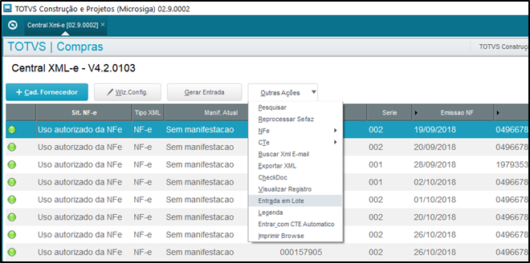
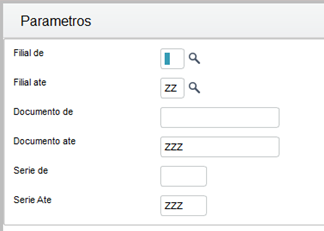
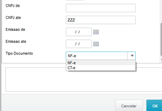
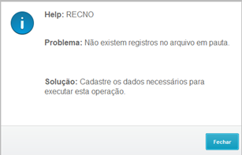
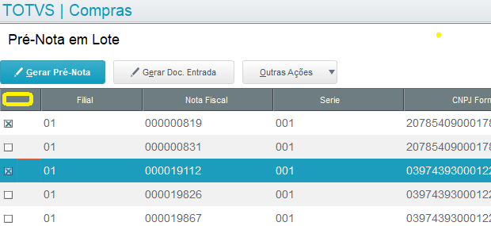
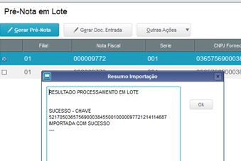
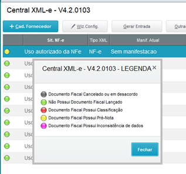
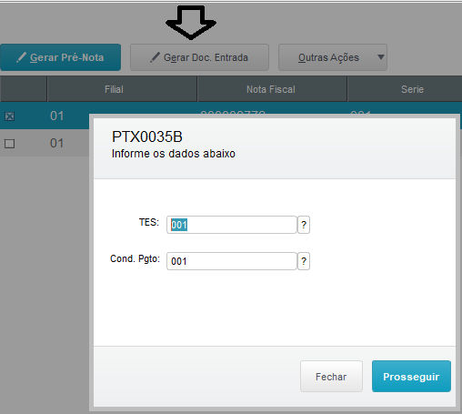
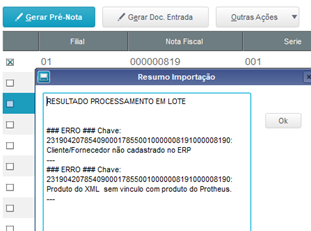

# Entrada em Lote

## Objetivo

Esta funcionalidade facilita a entrada massiva de Pré-notas e Documento de Entrada, desde que os fornecedores e sua relação de produtos por fornecedor já exista no Facile XML.

*Observação técnica: A rotina processa os arquivos XML que foram previamente baixados e armazenados na tabela ZZZ.*

Para utilizar a funcionalidade, no Protheus, acesse a rotina da Central XML-e que esta devidamente configurada no seu menu e selecione: **Outras Ações > Entrada em Lote.**

- Como na imagem abaixo:

{: .center-img }
Figura 1: Opção entrada em lote 

## Definir os filtros para receber os XMLs

{: .center-img }
Figura 2: Tela de Parâmetros 

- **Filial de; até:** Selecionar a filial;
- **Documento de; até:** Intervalo dos códigos dos documentos de entrada;
- **Serie de; até:** Intervalo das séries dos documentos de entrada;
  

{: .center-img }
Figura 3: Tela de Parâmetros* 

- **CNPJ de; até:** Intervalo dos CNPJs dos fornecedores – numéricos e sem formatação;
- **Emissão de; até:** Intervalo das datas das entradas das notas;
- **Tipo de Documento:** Nf-e;
  

Caso os filtros aplicados não encontrem concordância com os dados no sistema, seja por divergência em datas, número de documento, CNPJ, ou outros critérios, a rotina exibirá a tela abaixo.

{: .center-img }
Figura 4: Erro nos filtros dos Parâmetros* 

***Nessa situação, refine os critérios do filtro e execute a rotina novamente.***

Após realizar o passo anterior você verá uma nova tela com os XMLs.

{: .center-img }
Figura 5: Pré-Nota em Lote* 

**Seleção em lote:** Para selecionar todos os XMLs de uma vez, clique duas vezes no cabeçalho da coluna destacada em amarelo. 

**Seleção individual:** Para selecionar registros específicos, marque manualmente a caixa de selação (*checkbox*) correspondente a cada XML.

## Gerar Pré-Nota de Entrada

Após selecionar os XMLs para entrada, clique no botão "Gerar Pré-nota".

{: .center-img }
Figura 6: Resultado do Processamento em Lote* 

Com isso, a pré-nota será gerada para os documentos selecionados.

Para atualizar o status no sistema, feche a tela de entrada em lote e retorne à tela principal do Facile XML-e.

{: .center-img }
Figura 7: Tela Principal da Facile XML-e com as Legendas 

Na tela principal, o registro processado terá sua legenda atualizada para a cor amarela, com o texto "Documento com Pré-nota".

Acesse a rotina padrão “Pre Nota Entrada”, e verifique que a nota processada já teve sua Pré-Nota gerada.

*OBS.: pode excluir a pré-nota e repetir o processo em lote.*

## Gerar Documento de Entrada

Ao apertar o botão "Gerar Doc. Entrada", aparecerá a tela abaixo.

{: .center-img }
Figura 8: Informar TES e Condição de Pagamento* 

Informar TES e condição de Pagamento.

***OBS.: Esta rotina dará entrada em notas, sem considerar obrigatoriedade de pedidos de compra.*** 
***OBS.2: Só recomendada para entradas de notas com a mesma TES e condição de pagamento.*** 
***OBS.3: Mesmo escolhendo a TES no filtro, havendo Pedido de Compra válido e com saldo nas tags xPed e nItemped será dado preferência à TES do PC (Pedido de Compra), ignorando os dados inseridos manualmente.***

Após “SALVAR”, pode verificar na rotina padrao protheus: “Documento de Entrada”, a nota de entrada.

## Erros nos processos, Gerar Pré-Nota e Gerar Documento de Entrada

{: .center-img }
Figura 10: Possíveis erros na Entrada em Lote* 

Caso o xml esteja sem vínculo com dados do Protheus, por exemplo: Fornecedor ou código de produto relacionado. 

Será apresentado o aviso de erro.

-FIM-
