

# Processo de Fracionar Itens

## Fracionar itens

Escolha o item a ser fracionado e clique duas vezes nele, nisso será aberto uma tela com a opção de Fracionar Item: 

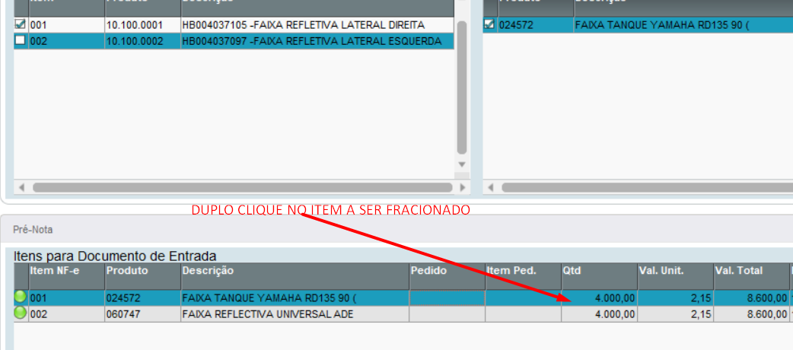
 *Figura 1: Início do processo para fracionamento de itens* 

 

Selecione a opção “Fracionar Item”: 

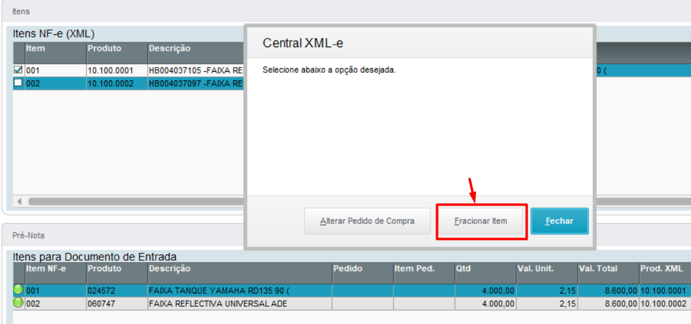
 *Figura 2: Tela com opção para fracionar item* 

 

Digite a quantidade para o segundo item: 

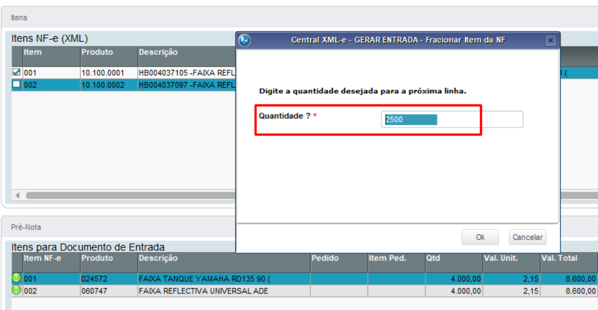
 *Figura 3: Tela para receber a quantidade fracionada* 

 

Veja que o item foi fracionado na quantidade informada: 

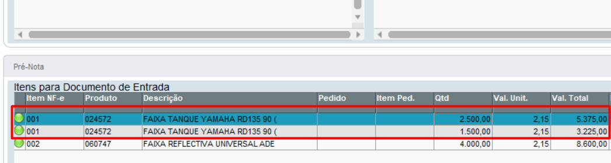
 *Figura 4: Exibição do item fracionado* 

 

Para vincular o pedido de compra no item fracionado, de novamente um duplo clique no item e dessa vez escolha a opção “Alterar pedido de compra”:

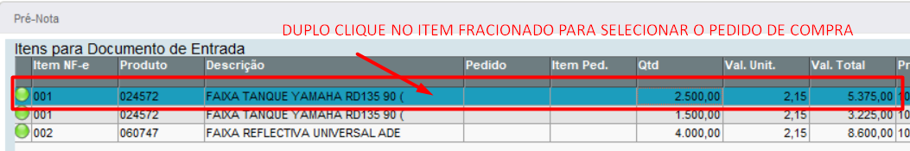
 *Figura 5: Item para alterar o PC* 

 

Selecione a opção “Alterar Pedido de Compra”: 

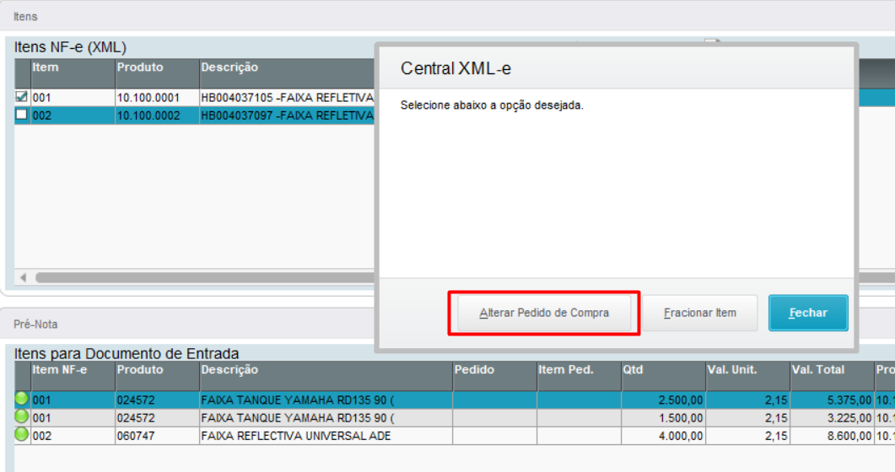
 *Figura 6: Alterar Pedido de Compra* 

 

Selecione o pedido de compra na nova tela:

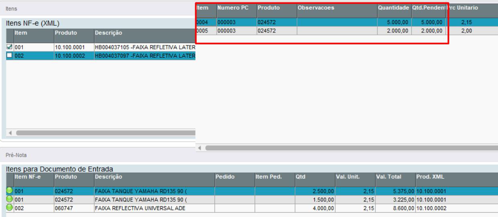
 *Figura  7: Selecionando PC* 

 

Selecione o segundo item e novamente dê um duplo clique para escolher o pedido de compra: 

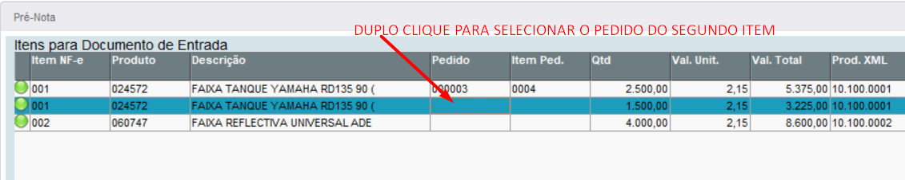
 *Figura 8: Associar segundo item a PC* 

 
 
Clique em “Alterar Pedido de Compra”:

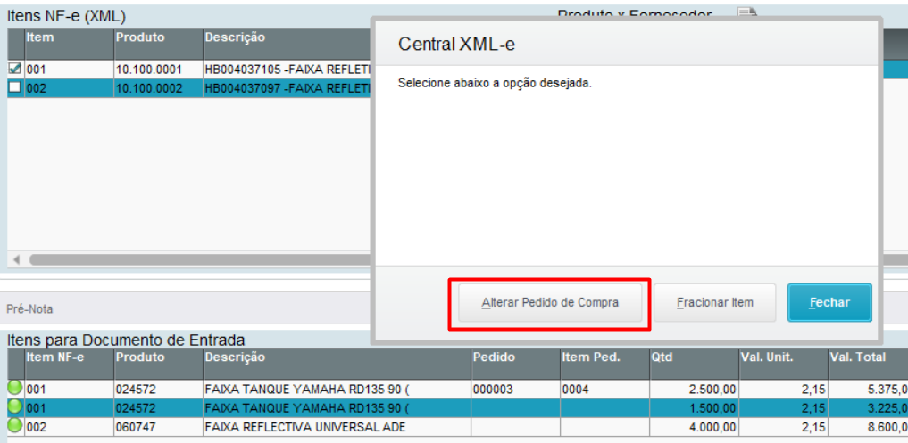
 *Figura 9: Alterar Pedido de Compra do segundo item* 

 

Selecione o pedido de compra para o segundo item:

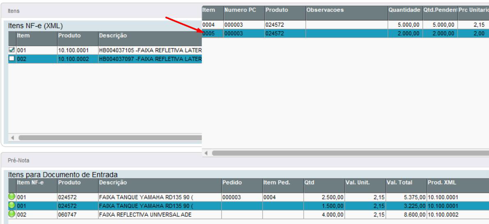
 *Figura 10: Selecionando PC do segundo item* 

 

Veja que os itens fracionados estão vinculados aos pedidos de compras selecionados: 

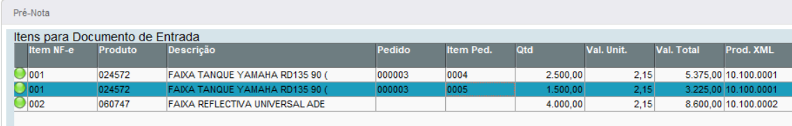
 *Figura 11: Itens associados à PC* 

 

Na tela para classificação, será gerado dois itens com as quantidades fracionadas: 

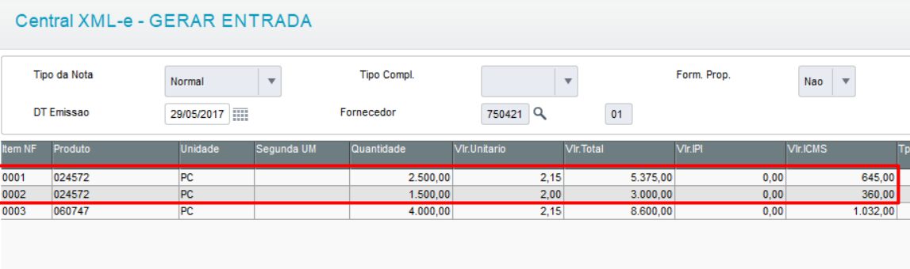
 *Figura 12: Classificação com item fracionado* 

 

E cada item terá a amarração com o seu respectivo pedido de compra: 

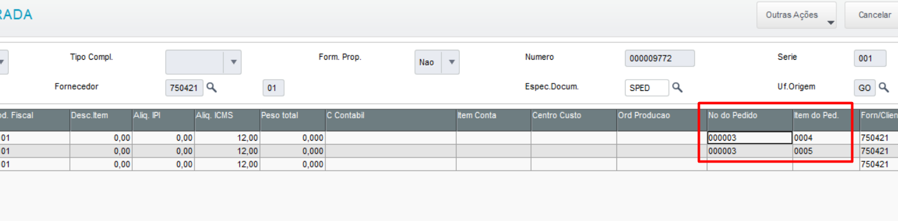
 *Figura 13: Classificação com amarração de Item x PC* 

 

-FIM-
