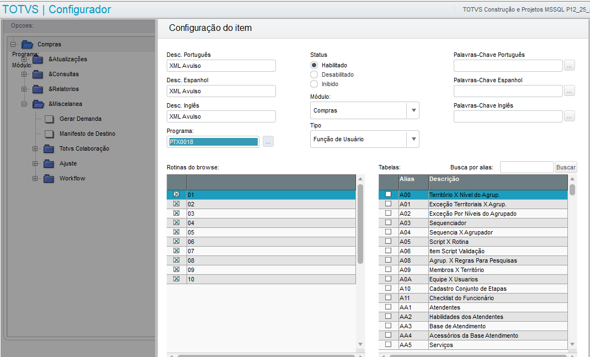
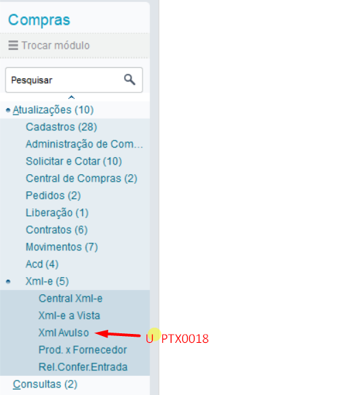
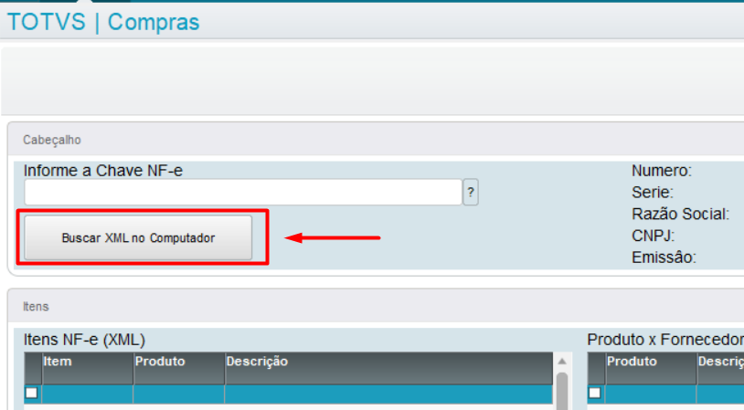
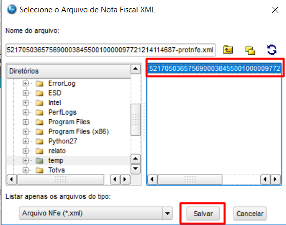
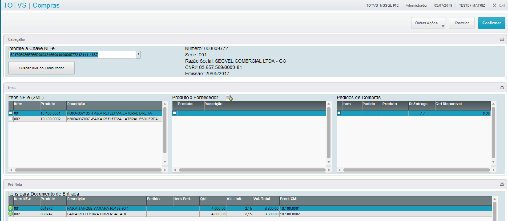

# Importação de XML manual

## Procedimento para Importação de XML direto do PC

Incluir nova opção no Menu (U\_PTX0018) 

 *Figura 1: Configuração do Menu* 

 

 *Figura 2: Menu com a função U_PTX0018* 

 

Entrar na rotina e clicar em "Buscar XML no Computador"

 *Figura 3: Buscar XML no Computador* 

 

Seleciona o XML no Computador 

 *Figura 4: Menu principal* 

 

A partir desse momento a entrada é feita de forma normal 

 *Figura 5: Menu principal* 

-FIM-
