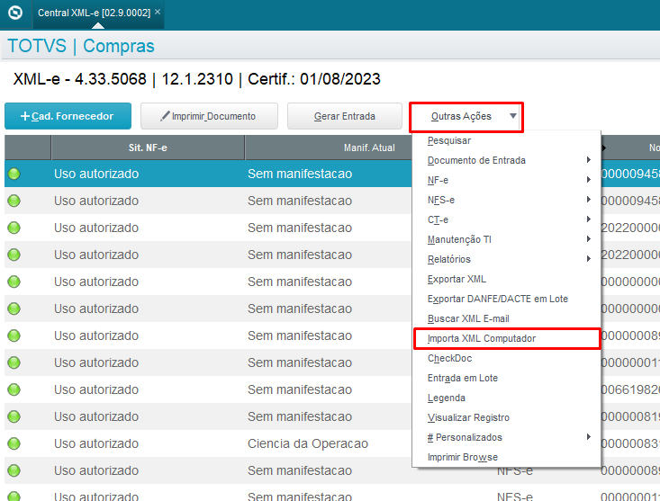
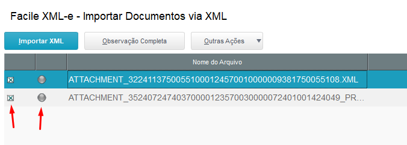
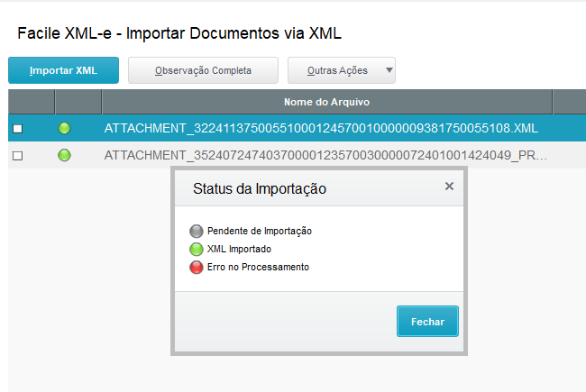

# Importação de XML manual

## Introdução

O objetivo da importação manual é realizar manualmente a importação de arquivos XML pontuais, de acordo com a necessidade.

## Como usar?

Na Central XML-e, ir em Outras Ações >> Importa XML Computador, conforme imagem abaixo. 

 *Figura 1: Acesso à rotina pela Central XML-e* {: .center-img }
 

Na janela de seleção, escolher o diretório onde estão os arquivos XML.

 *Figura 2: Escolher diretório* {: .center-img }
 

Na tela da rotina, basta selecionar os arquivos desejados. É importante prestar atenção na legenda, apenas arquivos com legenda cinza podem ser importados.

 *Figura 3: Tela de importação* {: .center-img }
 

Após isso, a mudança de status indicará se a importação foi bem-sucedida. Para finalizar, basta sair da rotina.

 *Figura 4: Tela pós importação e legendas* {: .center-img }
 

-FIM-
