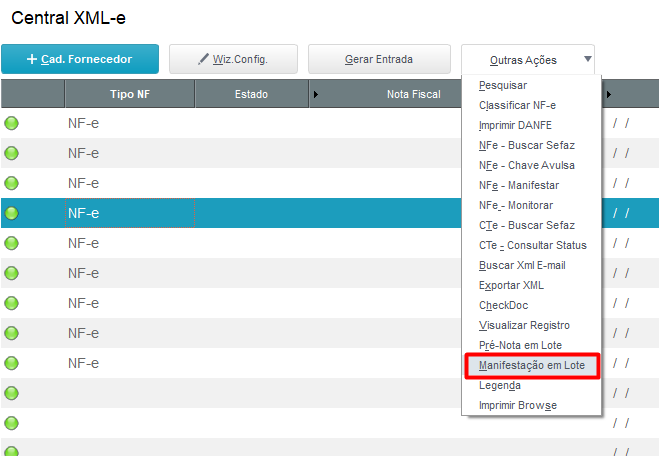
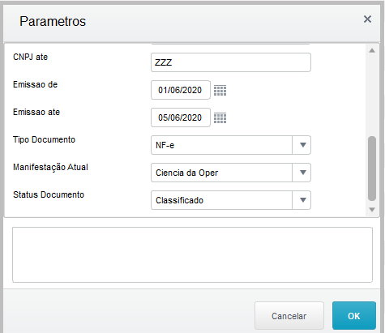
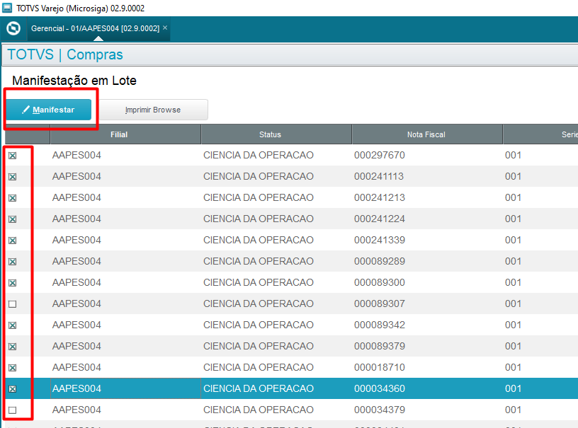
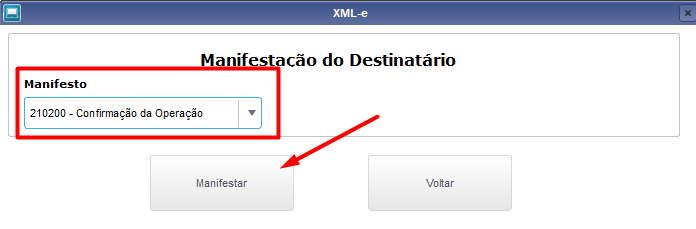
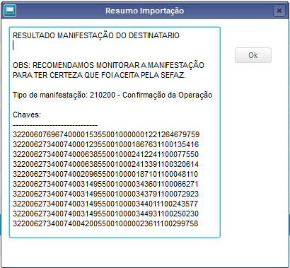

# Manifestação em lote

## Processo de manifestação do destinatário em lote

Na rotina Central XML-e acessar “Outras Ações” e depois **“Manifestação em Lote”**.

{: .center-img }
 *Figura 1: Opção no menu 'Manifestação em Lote'* 
 

Será permitido realizar diversos tipos de filtros diferentes nas perguntas logo no início da rotina:

{: .center-img }
 *Figura 2: Tela de Parâmetros* 
 

Outros filtros poderão ser realizados diretamente na tela de manifestação em lote.
Selecione as chaves que deseja selecionar marcando um [X] nelas e clique no botão “Manifestar”.

{: .center-img }
 *Figura 3: Seleção para Manifestar* 
 

Será solicitado qual o tipo de manifestação deseja realizar:

{: .center-img }
 *Figura 4: Seleção do tipo de Manifestação* 
 

Ao final do processamento será exibido uma tela com todas as chaves que foram manifestadas, conforme imagem abaixo:

{: .center-img }
 *Figura 5: Tela com chaves manifestadas* 
 

-FIM-
