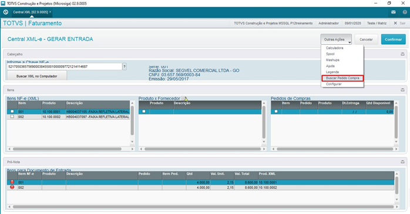
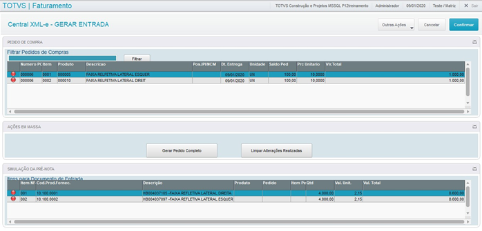
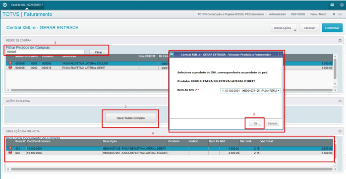
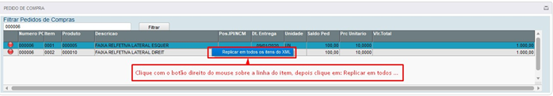
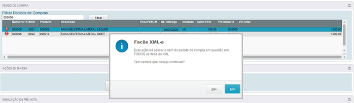
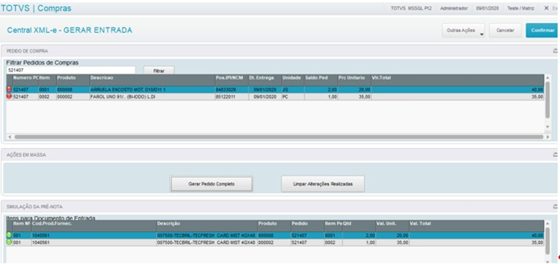

# Funcionalidades para o Pedido de Compra

## Conteúdo

**Este passo a passo contém as seguintes etapas:**

1. Ajustar o Pedido de compras para marcar **todos** os itens do pedido ao invés de apenas um.

2. Deixar entrar com um só item no **pedido de compra**.

3. Receber um item apenas no **xml** que entra no pedido de compra quebrado em mais itens.

Para acessar a nova funcionalidade, acesse a Central xml-e devidamente configurada em seu menu no Protheus e selecione o registro que deseja realizar a rotina.

Com o registro já selecionado clique em: **Gerar Entrada** > **Outras Ações > Buscar Pedido Compra**. Como na imagem abaixo:

{: .center-img }
*Figura 01: Buscar Pedido de Compra*

## Marcar todos os itens de um Pedido
Ajustar o Pedido de compras para marcar todos os itens do pedido ao invés de apenas um.

Após fazer o passo anterior você verá uma nova tela com os pedidos de compra feitos para o fornecedor selecionado. Com isso você poderá selecionar/vincular os itens de forma mais conveniente e intuitiva veja:

{: .center-img }
*Figura 02: PC para o Fornecedor selecionado*

### Selecionando/vinculando os itens

Siga a sequência:

{: .center-img }
*Figura 03: Seleção de itens*

1.1. Selecione um único pedido de compra no campo **Filtrar Pedidos de Compras**.

1.2. Clique no botão **Gerar Pedido de Compra**.

1.3. Na caixa que abrir você selecionará os **Itens do XML** e assim os mesmos aparecerão no próximo passo. ***Caso a caixa não apareça, significa que os itens já foram vinculados (Produto x Fornecedor)***.

1.4. Os itens selecionados na **simulação da pré-nota** mudarão a cor do status para verde.  Para desfazer, clique no botão **Limpar Alterações Realizadas** ou clicar no botão **confirmar** para finalizar a ação. 

## Entrada com item único
Deixar entrar com um só item no pedido de compra.

Com o registro já selecionado clique em: **Gerar Entrada > Outras Ações > Buscar Pedido Compra**. Como na imagem abaixo:

{: .center-img }
*Figura 4: Buscar Pedido de Compra*

2.1. Escolha um item do pedido e clique com o botão direito do mouse na **linha** do item escolhido.  Uma caixa abrirá com a opção de  **Replicar em todos os itens do XML.**  Clique na mesma.

{: .center-img }
*Figura 05: Replicar em todos os itens do XML*

2.2. Um aviso de confirmação irá ser exibido.

{: .center-img }
*Figura 06: Confirmação de aplicação*

Clicando em SIM, os itens na seção **Simulação da Pré-Nota.** Ficarão com o status verde.

Depois basta clicar no botão **confirmar** para finalizar a ação ou no botão **Limpar Alterações Realizadas** para cancelar.

## Item único do XML quebrado em mais itens
Receber um item apenas no xml que entra no pedido de compra quebrado em mais itens.

Com o registro já selecionado clique em: **Gerar Entrada > Outras Ações > Buscar Pedido Compra**. Como na imagem abaixo:

{: .center-img }
*Figura 07: Buscar Pedido de Compra*

3.1. Selecione um único pedido de compra no campo **Filtrar Pedidos de Compras.**

3.2. Depois clique em gerar pedido completo**.**

{: .center-img }
*Figura 08: Gerar Pedido Completo*

Alguns pedidos de compra que possuem muitos itens e quando o fornecedor envia a nota fiscal vem apenas um único item contemplando todos os itens do pedido de compra. Após esse processo os itens do pedido estarão na sessão da pré-nota, mesmo se o XML tiver apenas um único item.

-FIM-
