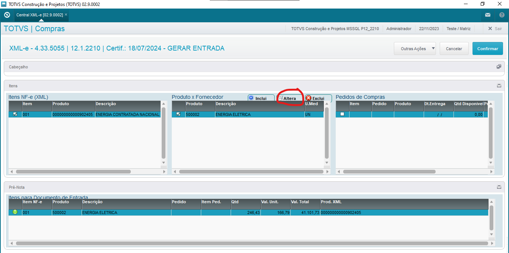
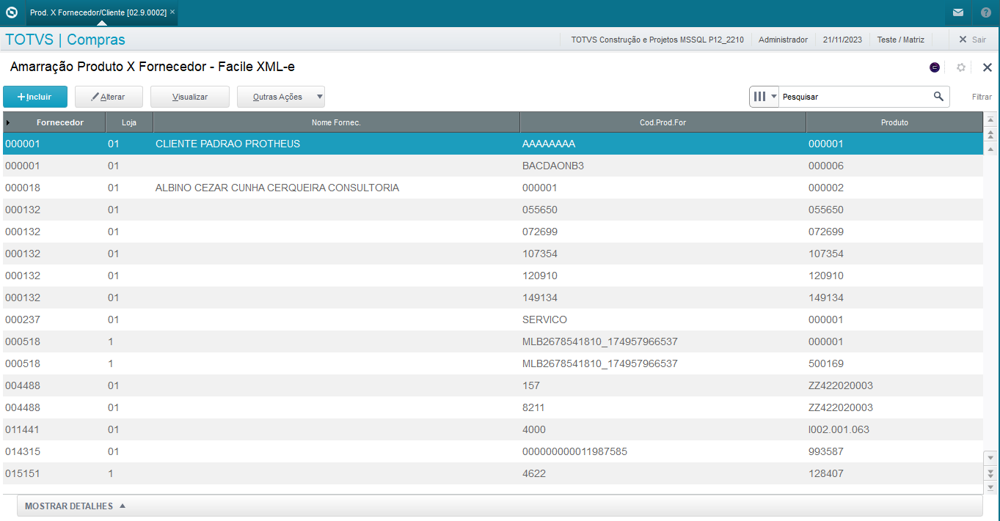
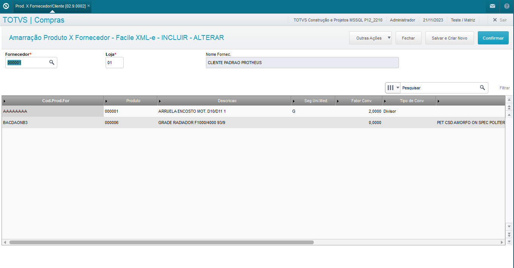
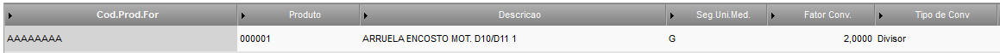

# Segunda Unidade de Medida da Amarração Produto x Fornecedor

A amarração Produto x Fornecedor da Central XML-e trás uma abrangência maior daquela que já existe no Protheus. Existem duas formas de acessá-la, atualmente. A primeira via menu, e a segunda na tela de "Gerar entrada" da Central XML-e ao clicar em "Alterar" no grid do meio.

{: .center-img }
Figura 1: Menu com a opção "Produto x Fornecedor"

{: .center-img }
Figura 2: Botão de alterar cadastro Produto x Fornecedor da Central XML

{: .center-img }
Figura 3: Tela Amarração Produto x Fornecedor

Na própria inclusão, percebe-se que não existe limitação por quantidade de produtos que possam existir para cada fornecedor, assim como o mesmo produto pode estar amarrado a diferentes fornecedores.

{: .center-img }
Figura 4: Fornecedor com vários produtos

No campo, "Seg.Uni.Med" podemos selecionar uma segunda unidade de medida, ao seu lado, o fator de conversão no campo "Fator. Conv," e o Tipo da conversão.

{: .center-img }
Figura 5: Grid com destaque na conversão

Para a segunda unidade de medida, precisamos dizer o fator de conversão e seu tipo. Por exemplo, o Produto 000001 tem como unidade de medida PC (Peça), mas caso ele entre em G (gramas) no sistema, precisamos fazer conversão, onde cada peça tem 2 gramas.

Nesse caso, selecionar o tipo de conversão como divisor, e, para cada 2 gramas de arruela, ele faria a conversão para 1 peça. Sendo assim, caso entremos com 40 gramas de arruela, o sistema automaticamente iria converter a entrada para 20 peças de arruela.

-FIM-
