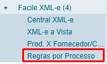
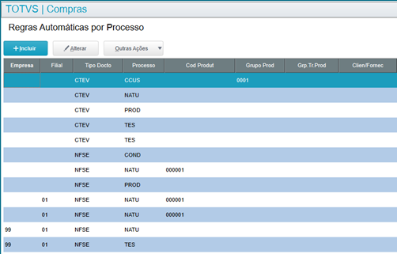
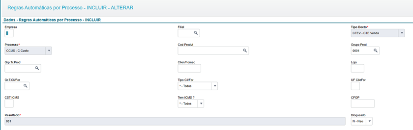

<style>
    p{
        text-align: justify;
    }
    #green{
        background-color: #16F529;
        display: inline;

    }
    #red{
        background-color: red;
        display: inline;
    }
    #blue{
        background-color: blue;
        display: inline;
    }
</style>

# Regras por Processo

## Introdução

Rotina “Regras por Processo” é o cadastro de regras da ferramenta Facile XML-e que serão utilizadas para retornar de maneira inteligente qual será a informação mais apropriada a ser utilizada em cada tipo de documento e processo.

## Como usar?

Deverá ser cadastrado todas as regras de filtros inteligentes para o retorno das informações necessárias para classificação do documento fiscal (TES, condição de pagamento, centro de custo, natureza e produto).

Implementar o novo JOB responsável por executar as importações automáticas através das regras por processo.

Programa: **U_PTXJ007**


**Exemplo via appserver.ini:**
```
[PTXJ007]
MAIN=U_PTXJ007
ENVIRONMENT=ENVIRONMENT
nparms=2
Parm1=01
Parm2=01

[ONSTART]
JOBS=PTXJ007
```

## Processos implementados / liberados até o momento

- CTEV – CTE de Venda
    - Ativado através do parâmetro: ZZ_CTEVAUT = .T. (deverá ser criado com tipo lógico)

- CTEC – CTE de Compra
    - Ativado através do parâmetro: ZZ_CTECAUT = .T. (deverá ser criado com tipo lógico)

- NFSE – Nota Fiscal de Serviço
    - Ativado através do parâmetro: ZZ_NFSEAUT = .T. (deverá ser criado com tipo lógico)

## Tabela de Regras por Processo

Segue abaixo os campos e detalhes sobre o preenchimento:

| Campo      | Descrição        | Observação{: .center-img } |
| ---------- | ---------------- | --------------------------- |
| <span style="color: blue">X001EMP</span>    | <span style="color: blue">Empresa</span>          | <span style="color: blue">Código da empresa caso a regra seja exclusiva de determinada empresa</span> |
| <span style="color: blue">X001FILIAL</span> | <span style="color: blue">Filial</span>           | <span style="color: blue">Código da filial caso a regra seja exclusiva de determinada filial</span> |
| <span style="color: red">X001TIPDOC</span> | <span style="color: red">Tipo Docto.</span>      | <span style="color: red">São os tipos de documentos possíveis de automatização: CTE Venda, NF-e de Compras, CTE de Compras, Devolução de Venda e NFS-e</span> |
| <span style="color: red">X001PROCES</span> | <span style="color: red">Processo</span>         | <span style="color: red">São os atributos que serão encontrados de forma automática para cada processo de acordo com as regras: Condição de pagamento, TES, Centro de custo, Natureza e Produto.</span> |
| <span style="color: blue">X001PRODUT</span> | <span style="color: blue">Cod. Produto</span>    | <span style="color: blue">Regra deve seja exclusiva para determinado produto (B1_COD)</span> |
| <span style="color: blue">X001GRPPRO</span> | <span style="color: blue">Grupo Produto</span>    | <span style="color: blue">Regra deve seja exclusiva para determinado grupo de produto (B1_GRUPO</span>) |
| <span style="color: blue">X001TRBPRO</span> | <span style="color: blue">Grp. Tr. Prod</span>.   | <span style="color: blue">Regra deve seja exclusiva para determinado grupo de tributação do produto (B1_GRTRIB</span>) |
| <span style="color: blue">X001CLIFOR</span> | <span style="color: blue">Clien. / Fornec</span>. | <span style="color: blue">Regra deve seja exclusiva para determinado cliente/fornecedor (A1_COD/A2_COD</span>) |
| <span style="color: blue">X001LOJA</span>   | <span style="color: blue">Loja</span>  | <span style="color: blue">Regra deve seja exclusiva para determinada loja do cliente/fornecedor (A1_LOJA/A2_LOJA</span>) |
| <span style="color: blue">X001TRCLFO</span> | <span style="color: blue">Gr. T. Cli. / For</span>. | <span style="color: blue">Regra deve seja exclusiva para determinado grupo de tributação de cliente/fornecedor (A2_GRPTRIB/A1_GRPTRIB</span>) |
| <span style="color: blue">X001TPCLFO</span> | <span style="color: blue">Tipo Cli. / For</span>. | <span style="color: blue">Regra deve seja exclusiva para determinado tipo de cliente/fornecedor (F7_TIPOCLI</span>) |
| <span style="color: blue">X001UF</span>     | <span style="color: blue">UF Clie. For</span>.    | <span style="color: blue">Regra deve seja exclusiva para determinado estado do cliente/fornecedor (A1_EST/A2_EST</span>) |
| <span style="color: blue">X001CSTICM</span> | <span style="color: blue">CST ICMS</span>         | <span style="color: blue">Regra deve seja exclusiva para determinada CST do ICMS</span> |
| <span style="color: blue">X001ICMS</span>   | <span style="color: blue">Tem ICMS</span>? | <span style="color: blue">Regra deve seja exclusiva caso exista ICMS no produto/documento</span> |
| <span style="color: blue">X001CFO</span>    | <span style="color: blue">CFOP</span> | <span style="color: blue">Regra deve seja exclusiva para determinado CFOP</span> |
| <span style="color: green">**ZZV_RESULT**</span> | <span style="color: green">**Resultado**</span> | <span style="color: green">**Resultado que será retornado pelo filtro (código da TES ou natureza ou centro de custo ou condição de pagamento ou produto)**</span> |

### Regras Gerais

- Os campos destacados em <div id="red">vermelho</div> são de preenchimento obrigatórios e indicam o tipo de documento e o tipo de informação (atributo) que será retornado.
- Os campos destacados em <div id="blue">azul</div> são utilizados para compor o filtro inteligente em busca da informação a ser retornada. 
- Caso não deseje que filtre alguns desses campos, basta deixá-los em branco.
- Os campos com “* - Todos” indicam que eles não serão considerados no filtro.
- O campo “CFOP” poderá ser utilizado os 3 dígitos finais do CFOP para filtro, exemplo: CFOP = 101 -> Será considerado para os CFOPS 1101 e 2101.
- Os campos destacados em <div id="green">verde</div> contém o valor a ser utilizado quando os filtros corresponderem ao processo (TES, condição de pagamento, natureza, centro de custo ou produto).
- O critério de seleção do registro a ser retornado será aquele que atender ao maior número de semelhanças com os campos de filtros.
- Em caso de empate entre duas ou mais regras, será utilizado a registro mais antigo.


### A Tela de Cadastro

A tela de cadastro das Regras por Processo poderá ser acessada no menu do Facile XML-e.


<br>*Figura 1: Menu com a opção 'Regras por Processo'*<br>{: .center-img }

**Nome da função de usuário:** PTX0052
<br>


<br>*Figura 2: Tela de Cadastro de Regras*<br>{: .center-img }
<br>


<br>*Figura 3: Tela de Cadastro*<br>{: .center-img }
<br>

### Sequências utilizadas para obtenção de cada atributo

#### NFSE: Nota Fiscal de Serviço Eletrônica

**Natureza (SED)**<br>
1 – Busca na regra de processos automáticos<br>
2 – Busca no cadastro do cliente/fornecedor (A1/A2_NATUREZ)

**Condição de Pagamento (SE4)**<br>
1 – Busca do pedido de compra (C7_COND)<br>
2 – Busca na regra de processos automáticos

**Produto (SB1)**<br>
1 – Busca da amarração produto x fornecedor Facile (ZZW)<br>
2 – Busca na regra de processos automáticos

**TES (SF4)**<br>
1 – Busca na regra de processos automáticos<br>
2 – Busca da TES inteligente (tipo de operação do parâmetro ZZ_OPERNFS)<br>
3 – Busca do Pedido de Compra (C7_TES)<br>
4 – Busca do produto (B1_TE)

**Centro de Custo (CTT)**<br>
1 – Busca do pedido de compra (C7_CC)<br>
2 – Busca na regra de processos automáticos<br>
3 – Busca do produto (B1_CC)

<br>
#### CTEV: CT-e de Venda

**Natureza (SED)**<br>
1 – Busca na regra de processos automáticos<br>
2 – Busca no cadastro do cliente/fornecedor (A1/A2_NATUREZ)

**Condição de Pagamento (SE4)**<br>
1 – Busca do pedido de compra (C7_COND)<br>
2 – Busca na regra de processos automáticos<br>
3 – Busca no cadastro do cliente/fornecedor (A1/A2_COND)

**Produto (SB1)**<br>
1 – Busca do parâmetro ZZ_PRODCTE<br>
2 – Busca na regra de processos automáticos

**TES (SF4)**<br>
1 – Busca do parâmetro ZZ_TESCTE<br>
2 – Busca na regra de processos automáticos<br>
3 – Busca da TES inteligente (tipo de operação do parâmetro ZZ_OPECTEV)<br>
4 – Busca do Pedido de Compra (C7_TES)<br>
5 – Busca do produto (B1_TE)

**Centro de Custo (CTT)**<br>
1 – Busca do pedido de compra (C7_CC)<br>
2 – Busca na regra de processos automáticos<br>
3	– Busca do produto (B1_CC)

<br>
#### CTEC: CT-e de Compra

**Natureza (SED)**<br>
1 – Busca na regra de processos automáticos<br>
2 – Busca da Nota Fiscal de Entrada referenciada (primeira NF do CTE)<br>
3 – Busca no cadastro do cliente/fornecedor (A1/A2_NATUREZ)

**Condição de Pagamento (SE4)**<br>
1 – Busca do pedido de compra (C7_COND)<br>
2 – Busca na regra de processos automáticos<br>
3 – Busca no cadastro do cliente/fornecedor (A1/A2_COND)

**Produto (SB1)**<br>
- De acordo com a NF referenciada

**TES (SF4)**<br>
1 – Busca do parâmetro ZZ_TESCTEC<br>
2 – Busca na regra de processos automáticos<br>
3 – Busca da TES inteligente (tipo de operação do parâmetro ZZ_OPECTEV)<br>
4 – Busca do Pedido de Compra (C7_TES)<br>
5 – Busca do produto (B1_TE)

**Centro de Custo (CTT)**<br>
- De acordo com a NF referenciada


<div style="text-align: center; font-weight: bold;">-FIM-</div>