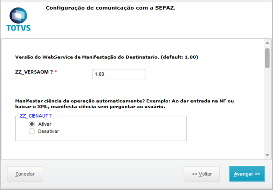
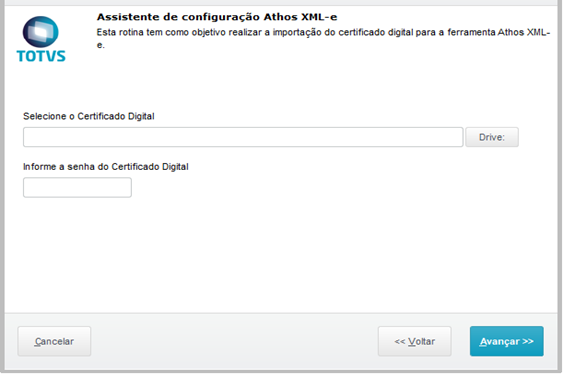

# Importar XML por e-mail

## Wizard de Configuração

Toda a configuração da ferramenta é realizada através de um único wizard, onde apenas os usuários do grupo de administradores do ERP possuem acesso.

O acesso ao wizard se encontra na rotina principal da ferramenta, a Central XML-e (PTX0001).

## Configuração

Ao abrir o wizard de configuração, clique em “Avançar” na tela de Bem-vindo para acessar a primeira página da configuração.

Vamos as opções:

 Figura 1: Wizard de Configuração {: .center-img }

Clique em avançar.

Configurar a Importação do certificado digital para comunicação com o SEFAZ.

 Figura 2: Importação do Certificado Digital {: .center-img }

Informe o caminho do arquivo do certificado digital (.PFX) e a sua senha de autenticação, processo parecido com o realizado na configuração do TSS.

Caso não possua o .PFX ou tenha alguma dificuldade na importação do certificado digital, poderá ser utilizado os arquivo “.PEM” gerados pelo TSS, bastando informar o caminho dos arquivos nos seguintes parâmetros:

**ZZ_CERTKEY:** Caminho para o arquivo “key.pem” no Protheus_Data.
	Exemplo: *\FACILE\9901_key.pem*
                                                                     
**ZZ_CERTPRI:** Caminho para o arquivo “cert.pem” no Protheus_Data.
	Exemplo: *\FACILE\9901_cert.pem*

**ZZ_CERTCA:** Caminho para o arquivo “ca.pem” no Protheus_Data.
	Exemplo: *\FACILE\9901_ca.pem*

Clique em avançar.

 Figura 3: Configuração de monitoramento de e-mail {: .center-img }

Nesta página será possível configurar a busca do XML diretamente de um endereço de e-mail, com isso a ferramenta irá realizar a busca de novas NF-e tanto o Sefaz, quanto o endereço de e-mail.

**ZZ_MAILXML:** Ativa a busca por XML no endereço de e-mail.

**ZZ_POPEND:** Informe o endereço do Servidor POP do e-mail a ser monitorado (requer o parâmetro ZZ_MAILXML ativado).

**ZZ_POPCNT:** Informe o login para autenticação no Servidor POP do e-mail a ser monitorado (requer o parâmetro ZZ_MAILXML ativado).

**ZZ_POPPSW:** Informe a senha para autenticação no Servidor POP do e-mail a ser monitorado (requer o parâmetro ZZ_MAILXML ativado).

**ZZ_POPSSL:** Ative esse parâmetro caso o Servidor POP utilize conexão segura para autenticação (requer o parâmetro ZZ_MAILXML ativado).

**ZZ_DELMAIL:** Ative esse parâmetro caso deseje que o e-mail seja excluído da caixa de entrada após a importação do mesmo (requer o parâmetro ZZ_MAILXML ativado).

Concluído.

Recomendamos fechar o ERP e abrir novamente para que todas as alterações sejam efetivadas.

## Utilização

Através do ***Central XML-e, vá em Outras Ações/Buscar Xml e-mail***. O sistema irá automaticamente baixar de acordo com o e-mail que foi configurado.

 Figura 4: Opção de Buscar Xml por E-mail {: .center-img }

-FIM-
