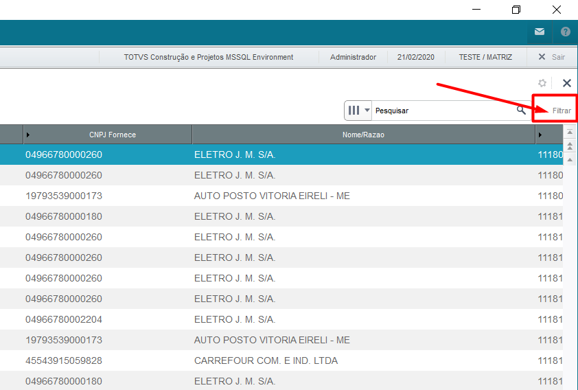
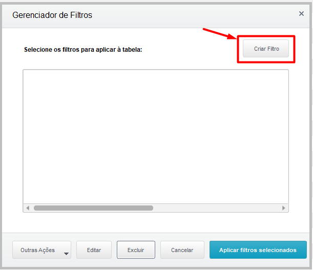
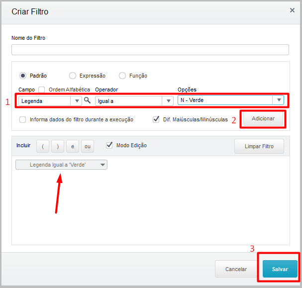
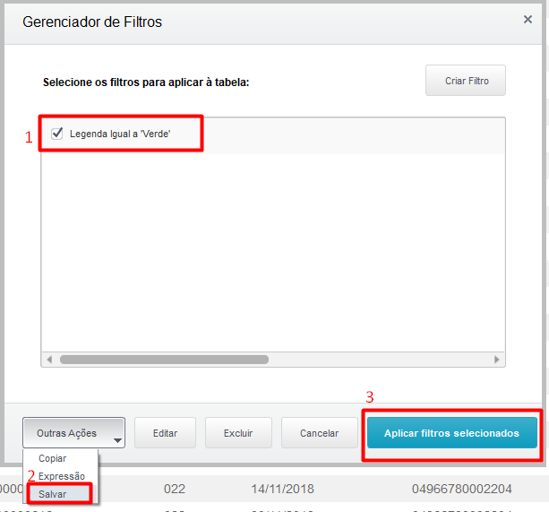

# Filtro de XML sem nota de entrada

## Criar filtro de XML sem nota de entrada

Na tela principal do FACILE central XML-e, clique na opção “Filtrar” no canto superior direito conforme destacado na imagem abaixo:

 *Figura 1: Opção de Filtrar* {: .center-img }
 

Na janela que abriu, clique em: “Criar Filtro”:

 *Figura 2: Criar Filtro* {: .center-img }
 

Na tela de filtros, configure conforme os passos destacados na imagem abaixo:

 *Figura 3: Adicionar Filtro* {: .center-img }
 

Marque a legenda criada, vai em “Outras Ações” e clique em “Salvar”. Após isso clique em “Aplicar filtros selecionados”.

 *Figura 4: Aplicar Filtro* {: .center-img }
 

-FIM-
